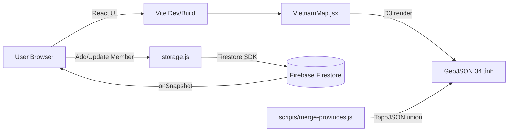

<h1 align="center">🗺️ Bản đồ Đồng Hương PM1</h1>

<p align="center">
  <strong>Web app tương tác giúp thành viên phòng Product Management 1 khám phá quê quán của nhau trên bản đồ Việt Nam 34 tỉnh.</strong>
</p>

<p align="center">
  <a href="https://pm1-member-map.vercel.app/"></a>
</p>

<p align="center">
  
  
  
  
  
  
</p>

<p align="center">
  <em>Vibe-coded với Claude Code · Tuân thủ Nghị quyết 202/2025/QH15 về 34 đơn vị hành chính cấp tỉnh.</em>
</p>

---

## 🎯 Vấn đề & Giải pháp

| 🧩 Vấn đề | ✅ Giải pháp |
|---|---|
| Phòng đông người, ít ai biết ai cùng quê với mình | Bản đồ choropleth trực quan hoá mật độ đồng hương theo tỉnh |
| Khó tìm chủ đề phá băng giữa các thành viên | Top 5 tỉnh + danh sách thành viên click-to-focus |
| Dữ liệu cá nhân thay đổi, đồng bộ thủ công mệt | Realtime sync qua Firebase Firestore — ai cập nhật là cả phòng thấy ngay |
| Bản đồ Việt Nam cũ 63 tỉnh đã lỗi thời từ 2025 | Merge geometry 63 → 34 tỉnh chuẩn Nghị quyết 202/2025/QH15 |

---

## ✨ Highlights

- 🗺️ **Bản đồ Việt Nam 34 tỉnh** — Render bằng D3.js từ GeoJSON, hỗ trợ zoom/pan/reset, choropleth coloring theo mật độ thành viên
- 👥 **Thêm thành viên nhanh** — Modal với cascading dropdown (tỉnh → quận/huyện) cho cả 34 tỉnh
- 🏆 **Top 5 tỉnh** — Bảng xếp hạng realtime tỉnh có nhiều thành viên nhất
- 🔍 **Click-to-focus** — Click vào tên thành viên trong danh sách → bản đồ tự zoom & highlight tỉnh tương ứng
- 💬 **Tooltip chi tiết** — Hover/click vào tỉnh để xem danh sách thành viên thuộc tỉnh đó
- ⚡ **Realtime sync** — Firestore `onSnapshot`, mọi thay đổi đẩy về client tức thì, không cần reload
- 🏝️ **Hoàng Sa & Trường Sa** — Hiển thị đầy đủ chủ quyền biển đảo
- 🌙 **Dark theme** — Tone navy/cyan, font Be Vietnam Pro, tối ưu cho màn hình văn phòng

---

## 🏗️ Architecture



**Data flow ngắn gọn:**
1. User mở app → React load GeoJSON 34 tỉnh đã merge sẵn → D3 render bản đồ
2. User thêm member → ghi vào Firestore → Firestore push update cho tất cả client đang mở
3. Component subscribe `onSnapshot` → re-render danh sách, top 5, và màu choropleth

---

## 🛠️ Tech Stack

| Layer | Technology | Lý do chọn |
|---|---|---|
| **Frontend** | React 19 + Vite 8 | Hot reload nhanh, bundle nhẹ, dev experience hiện đại |
| **Bản đồ** | D3.js (d3-geo, d3-zoom, d3-selection) | Render SVG chính xác từ GeoJSON, tuỳ biến cao hơn Leaflet |
| **Database** | Firebase Firestore | Realtime out-of-the-box, miễn phí cho team < 50k reads/day |
| **Địa lý** | TopoJSON + @turf/union | Merge geometry 63 → 34 tỉnh không bị crack ranh giới |
| **Styling** | CSS thuần + Be Vietnam Pro | Không cần Tailwind cho project size này, font Việt đẹp |
| **Deploy** | Vercel | Auto-deploy từ Git, edge network, miễn phí |

---

## 🚀 Quickstart

```bash
# 1. Clone repo
git clone https://github.com/huyhn-ba-po/pm1-member-map.git
cd pm1-member-map

# 2. Cài dependencies
npm install

# 3. Tạo file .env từ template
cp .env.example .env
# → Điền Firebase config (apiKey, projectId, ...) vào .env

# 4. Chạy dev server
npm run dev
# → Mở http://localhost:5173
```

**Lint & Build:**

```bash
npm run lint      # ESLint kiểm tra code
npm run build     # Build production vào /dist
npm run preview   # Preview bản production locally
```

---

## 📂 Cấu trúc dự án

```
pm1-member-map/
├── public/                        # Static assets
├── scripts/                       # Build-time data scripts
│   └── merge-provinces.js         # Merge 63 → 34 tỉnh bằng TopoJSON
├── src/
│   ├── components/
│   │   ├── VietnamMap.jsx         # Bản đồ D3.js chính
│   │   ├── AddMemberModal.jsx     # Modal thêm thành viên
│   │   ├── MemberList.jsx         # Danh sách thành viên
│   │   └── Top10.jsx              # Top 5 tỉnh nhiều thành viên
│   ├── data/
│   │   ├── provinceCoords.js      # Tọa độ + danh sách quận/huyện
│   │   ├── vn-34provinces.json    # GeoJSON 34 tỉnh hợp nhất
│   │   └── vn-provinces.json      # GeoJSON 63 tỉnh gốc (input)
│   ├── services/
│   │   ├── firebase.js            # Firebase initialization
│   │   └── storage.js             # Firestore CRUD wrapper
│   ├── App.jsx                    # Root component
│   └── main.jsx                   # Vite entry point
├── .env.example                   # Template biến môi trường
├── vite.config.js                 # Vite config
└── package.json
```

---

## 🗃️ Data Model

**Firestore collection: `members`**

```ts
{
  id: string;                // auto-generated by Firestore
  name: string;              // "Nguyễn Văn A"
  province: string;          // "Hà Nội", "TP. Hồ Chí Minh", ...
  district: string;          // "Cầu Giấy", "Quận 1", ...
  createdAt: Timestamp;
}
```

**Indexes cần có:** không bắt buộc — dataset < 1000 docs nên Firestore tự index.

---

## 🗺️ Roadmap

- [x] Phase 1 — Setup React + Vite, render bản đồ cơ bản
- [x] Phase 2 — Merge 63 → 34 tỉnh theo Nghị quyết 202/2025/QH15
- [x] Phase 3 — Tích hợp Firebase Firestore + realtime sync
- [x] Phase 4 — UI dark theme, modal thêm member, top 5, tooltip
- [x] Phase 5 — Deploy production lên Vercel
- [ ] Phase 6 — Auth (Google SSO) để member tự quản lý profile
- [ ] Phase 7 — Photo avatar + cluster marker khi nhiều member cùng quận
- [ ] Phase 8 — Export CSV / báo cáo phân bố theo vùng (Bắc/Trung/Nam)
- [ ] Phase 9 — Mobile responsive (hiện tối ưu desktop)

---

## 🤝 Đóng góp

Project nội bộ phòng PM1, nhưng nếu bạn muốn fork và áp dụng cho team mình:

1. Fork repo
2. Tạo branch `feat/your-feature`
3. Commit theo Conventional Commits (`feat:`, `fix:`, `chore:`)
4. Open PR — mình review trong vòng 1-2 ngày

---

## 👤 Tác giả

**Huỳnh Nhật Huy** — IT Business Analyst @ Fintech & Digital Banking

- LinkedIn: [nhathuyba](https://www.linkedin.com/in/nhathuyba/)
- GitHub: [@huyhn-ba-po](https://github.com/huyhn-ba-po)

> Built for Product Management 1 team — turning org chart into a map of stories.
